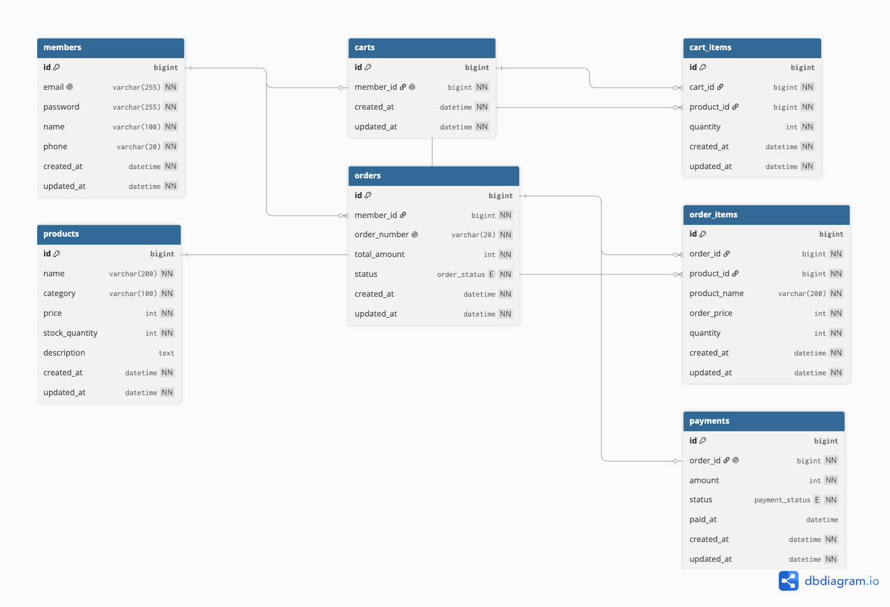

# 🛒 Commerce Payment System

Spring Boot 기반의 커머스 결제 백엔드 시스템입니다.

회원가입과 로그인부터 상품 조회, 장바구니, 주문, 결제 및 결제 취소까지
커머스 서비스의 핵심 비즈니스 흐름을 구현했습니다.

단순한 도메인별 CRUD 구현을 넘어,
**JWT 기반 사용자 인증, 재고 관리, 주문·결제 상태 전이, 소유권 검증과 데이터 정합성**을
하나의 흐름 안에서 처리하는 것을 목표로 했습니다.

---

## 1. 프로젝트 소개

### 프로젝트 목표

커머스 서비스의 핵심 흐름인

**회원 인증 → 상품 조회 → 장바구니 → 주문 → 결제 → 결제 취소**

과정을 하나의 백엔드 시스템으로 연결했습니다.

주요 구현 목표는 다음과 같습니다.

- Spring Security와 JWT를 이용한 사용자 인증
- 로그인한 사용자를 기준으로 한 리소스 접근 및 소유권 검증
- 상품 목록·상세 조회 및 조건별 검색
- 장바구니 상품 및 수량 관리
- 주문 생성 시 상품 재고 검증 및 선차감
- 주문 시점의 상품명·가격 스냅샷 저장
- 모의 결제 성공·실패 처리
- 주문과 결제의 상태 전이 관리
- 주문 취소 및 결제 취소 시 재고 복구
- 공통 예외 응답을 통한 일관된 오류 처리

---

## 2. 기술 스택

### Backend

- Java 17
- Spring Boot 4.1.0
- Spring MVC
- Spring Data JPA
- Spring Security
- JWT (JJWT 0.13.0)
- QueryDSL 5.1.0
- Bean Validation
- Lombok
- Gradle

### Database

- MySQL

### Development / Test

- IntelliJ IDEA
- Postman
- DBeaver

### Collaboration

- Git
- GitHub
- GitHub Pull Request

---

## 3. 팀 구성 및 기여 내용 (R&R)

| 담당 영역 | 담당자 | 주요 역할 및 기여 |
| --- | --- | --- |
| 인증·인가 | 최정윤 | 회원가입·로그인, BCrypt 비밀번호 암호화, JWT 발급 및 검증, Spring Security 인증 처리, 현재 로그인 사용자 식별 |
| 상품 | 왕준호 | 상품 도메인의 초기 CRUD 및 기본 구조 구성 |
| 상품 | 최정윤 | 기존 상품 도메인 인계 후 ERD·API 명세 기준 리팩터링 및 최종화, QueryDSL 동적 검색, 페이지네이션, 검색 예외 처리, 재고 차감·복구 로직, 목록·상세 DTO 분리, 테스트 데이터 구성 및 Postman 검증 |
| 장바구니 | 이윤지 | 장바구니 상품 추가·조회·수량 변경·삭제, 동일 상품 수량 누적 및 재고 검증 |
| 주문 | 강성현 | 주문 생성·목록·상세 조회, 주문 취소, 주문 상태 관리, 재고 선차감 및 복구, Facade를 통한 복합 주문 흐름 구성 |
| 결제 | 김예림 | 모의 결제 성공·실패 처리, 결제 단건 조회, 결제 취소, 금액·소유권·상태 검증 및 주문·재고·장바구니 연동 |

---

## 4. 핵심 흐름

### 전체 서비스 흐름

```text
회원가입 / 로그인
        ↓
     JWT 발급
        ↓
     상품 조회
        ↓
    장바구니 담기
        ↓
      주문 생성
        ↓
     재고 검증
        ↓
     재고 선차감
        ↓
 Order PAYMENT_PENDING
        ↓
     결제 요청
      ↙       ↘
   SUCCESS     FAIL
      ↓          ↓
Payment       Payment
COMPLETED      FAILED
      ↓          ↓
Order          Order
COMPLETED     CANCELLED
      ↓          ↓
장바구니       재고 복구
  비우기      장바구니 유지
```

### 결제 전 주문 취소

```text
주문 취소 요청
      ↓
로그인 사용자 확인
      ↓
주문 소유권 확인
      ↓
주문 상태 검증
      ↓
Order → CANCELLED
      ↓
주문 상품 재고 복구
```

### 결제 완료 후 결제 취소

```text
결제 취소 요청
      ↓
로그인 사용자 확인
      ↓
결제 소유권 확인
      ↓
결제 / 주문 상태 검증
      ↓
Payment → CANCELLED
      ↓
Order → CANCELLED
      ↓
주문 상품 재고 복구
```

### 핵심 비즈니스 원칙

- 로그인 사용자는 JWT에서 추출한 사용자 정보를 기준으로 식별합니다.
- 클라이언트가 임의로 전달한 회원 ID에 의존하지 않습니다.
- 주문 생성 시 현재 상품 재고를 검증한 뒤 주문 수량만큼 선차감합니다.
- 주문 상품에는 주문 당시의 상품명과 가격을 스냅샷으로 저장합니다.
- 결제 요청 금액과 서버의 실제 주문 금액을 비교합니다.
- 결제 성공 시 주문을 완료 처리하고 장바구니를 비웁니다.
- 결제 실패 시 주문을 취소하고 선차감한 재고를 복구합니다.
- 결제 완료 건을 취소하면 주문과 결제 상태를 함께 변경하고 재고를 복구합니다.
- 허용되지 않는 상태 전이는 Entity의 상태 전이 규칙을 통해 제한합니다.

---

## 5. 주요 기능

### 🔐 인증·회원

- 회원가입
- 이메일 중복 검증
- BCrypt 기반 비밀번호 암호화
- 로그인
- JWT Access Token 발급
- JWT 기반 요청 인증
- 현재 로그인 회원 정보 조회
- 인증이 필요한 API와 공개 API 구분

### 📦 상품

- 상품 목록 조회
- 상품 상세 조회
- 카테고리 검색
- 최소·최대 가격 검색
- QueryDSL 기반 동적 AND 검색
- Pageable 기반 페이지네이션
- 최신 등록순 정렬
- 잘못된 검색 조건 검증
- 재고가 0인 상품 조회 지원
- 상품 재고 차감 및 복구

### 🛒 장바구니

- 장바구니 상품 추가
- 내 장바구니 조회
- 장바구니 상품 수량 변경
- 개별 상품 삭제
- 장바구니 전체 비우기
- 동일 상품 추가 시 기존 수량에 누적
- 상품의 현재 재고를 초과하는 수량 요청 방지
- 로그인 사용자를 기준으로 장바구니 데이터 관리

### 📑 주문

- 장바구니 기반 주문 생성
- 일부 장바구니 상품 선택 주문
- 요청 항목이 없는 경우 전체 장바구니 주문
- 내 주문 목록 페이지네이션 조회
- 주문 상세 조회
- 결제 전 주문 취소
- 주문 생성 시 재고 검증 및 선차감
- 주문 상품명·주문 당시 가격 스냅샷 저장
- 주문 상태 전이 관리
- 주문 취소 시 재고 복구
- 복합 변경 작업에 OrderFacade 적용

### 💳 결제

- 모의 결제 성공·실패 처리
- 결제 단건 조회
- 결제 완료 건 취소
- 로그인 사용자 기준 주문·결제 소유권 검증
- 요청 결제 금액과 실제 주문 금액 검증
- 결제 상태 전이 관리
- 주문 상태와 결제 상태 연동
- 결제 성공 시 장바구니 비우기
- 결제 실패 시 주문 취소 및 재고 복구
- 결제 취소 시 주문 취소 및 재고 복구
- 중복 결제 및 중복 취소 방지

### ⚠️ 공통 예외 처리

- 공통 `CustomException` 사용
- 도메인별 `ErrorCode` 관리
- `@RestControllerAdvice` 기반 예외 응답 처리
- Bean Validation 실패 시 일관된 400 응답 제공

---

## 6. ERD

### 주요 엔티티

```text
Member
  │
  │ 1 : 1
  ▼
Cart
  │
  │ 1 : N
  ▼
CartItem ───── N : 1 ───── Product


Member
  │
  │ 1 : N
  ▼
Order
  │
  ├──── 1 : N ──── OrderItem ──── N : 1 ──── Product
  │
  └──── 1 : 1 ──── Payment
```

### 주요 관계

| 관계 | 설명 |
| --- | --- |
| Member : Cart | 회원별 하나의 장바구니를 관리합니다. |
| Cart : CartItem | 하나의 장바구니에 여러 상품 항목을 저장합니다. |
| Product : CartItem | 하나의 상품이 여러 장바구니 항목에 포함될 수 있습니다. |
| Member : Order | 한 회원이 여러 주문을 생성할 수 있습니다. |
| Order : OrderItem | 하나의 주문은 여러 주문 상품을 가질 수 있습니다. |
| Product : OrderItem | 주문 상품은 실제 상품을 참조합니다. |
| Order : Payment | 하나의 주문에는 최대 하나의 결제 정보가 연결됩니다. |

### 주요 데이터 설계

- 회원 이메일은 중복될 수 없습니다.
- 회원별 장바구니는 하나만 존재하도록 제한합니다.
- 동일한 장바구니에 같은 상품이 여러 행으로 중복 저장되지 않도록 제한합니다.
- 주문 번호는 고유한 값으로 생성합니다.
- `OrderItem`에 상품명과 주문 당시 가격을 저장해 상품 정보 변경의 영향을 받지 않도록 합니다.
- `Payment.order_id`에 UNIQUE 제약을 적용해 하나의 주문에 하나의 결제만 연결되도록 합니다.

<!-- TODO: 최종 ERD 이미지 추가 -->
<!-- 예:  -->

---

## 7. API 명세

### 인증 / 회원

| Method | URL | 설명 | 인증 |
| --- | --- | --- | --- |
| POST | `/api/auth/signup` | 회원가입 | X |
| POST | `/api/auth/login` | 로그인 및 JWT 발급 | X |
| GET | `/api/members/me` | 현재 로그인 회원 정보 조회 | O |

### 상품

| Method | URL | 설명 | 인증 |
| --- | --- | --- | --- |
| GET | `/api/products` | 상품 목록 조회 및 조건 검색 | X |
| GET | `/api/products/{productId}` | 상품 상세 조회 | X |

#### 상품 목록 Query Parameter

| Parameter | 필수 | 설명 |
| --- | --- | --- |
| `category` | X | 상품 카테고리 |
| `minPrice` | X | 최소 가격 |
| `maxPrice` | X | 최대 가격 |
| `page` | X | 페이지 번호, 기본값 `0` |
| `size` | X | 페이지 크기, 기본값 `20` |

### 장바구니

| Method | URL | 설명 | 인증 |
| --- | --- | --- | --- |
| POST | `/api/carts/items` | 장바구니에 상품 추가 | O |
| GET | `/api/carts` | 내 장바구니 조회 | O |
| PATCH | `/api/carts/items/{cartItemId}` | 장바구니 상품 수량 변경 | O |
| DELETE | `/api/carts/items/{cartItemId}` | 장바구니 상품 삭제 | O |
| DELETE | `/api/carts/items` | 장바구니 전체 비우기 | O |

### 주문

| Method | URL | 설명 | 인증 |
| --- | --- | --- | --- |
| POST | `/api/orders` | 장바구니 기반 주문 생성 | O |
| GET | `/api/orders` | 내 주문 목록 페이지네이션 조회 | O |
| GET | `/api/orders/{id}` | 주문 상세 조회 | O |
| PATCH | `/api/orders/{id}/cancel` | 결제 전 주문 취소 | O |

#### 주문 생성

`cartItemIds`에 주문할 장바구니 항목 ID를 전달합니다.

```json
{
  "cartItemIds": [1, 2]
}
```

`cartItemIds`가 없거나 비어 있는 경우 현재 장바구니의 전체 상품을 주문합니다.

#### 결제 전 주문 취소

```json
{
  "action": "CANCEL"
}
```

### 결제

| Method | URL | 설명 | 인증 |
| --- | --- | --- | --- |
| POST | `/api/payments/confirm` | 모의 결제 성공·실패 처리 | O |
| GET | `/api/payments/{paymentId}` | 결제 단건 조회 | O |
| PATCH | `/api/payments/{paymentId}/cancel` | 완료된 결제 취소 | O |

#### 모의 결제 요청

```json
{
  "orderId": 1,
  "result": "SUCCESS",
  "amount": 30000
}
```

`result`는 모의 결제 결과를 의미하며 `SUCCESS` 또는 `FAIL`을 사용합니다.

### 인증 정책

- `/api/auth/**`는 인증 없이 접근할 수 있습니다.
- `GET /api/products/**`는 인증 없이 접근할 수 있습니다.
- 그 외 API는 JWT 인증이 필요합니다.